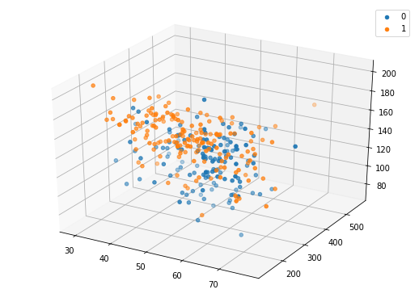

# Tarefa 2: Aprendizado Supervisionado

**Autor**: Matheus Jericó Palhares <br>
**LinkedIn**: https://linkedin.com/in/matheusjerico <br>
**Github**: https://github.com/matheusjerico

### 1) Tarefa 1: implementar a função “predict_KNN(pontos, ponto)”, que recebe o conjunto de treinamento e o ponto cuja classe será predita e retornada

- Para a tarefa 1: um scatter plot 3D mostrando os pontos de treinamento, os pontos que estão sendo preditos (acima deles, deve haver uma annotation com a classe em que foram classificados) e um código de cores intuitivo.
- Compare os seus resultados com os obtidos através do sklearn.neighbors.KNeighborsClassifier e do sklearn.neighbors.KNeighborsRegressor. Os seus resultados e os resultados do sklearn deveriam ser iguais.

### Bibliotecas


```python
import numpy as np
import matplotlib.pyplot as plt
import pandas as pd
import random as rd
import itertools
from sklearn.neighbors import KNeighborsClassifier
from sklearn.metrics import accuracy_score
from mpl_toolkits.mplot3d import Axes3D
```

## Tarefa 1

### 1. Carregando dados


```python
dataset = pd.read_csv("./Dataset/heart.csv")
dataset.head()
```


<div>
<table border="1" class="dataframe">
  <thead>
    <tr style="text-align: right;">
      <th></th>
      <th>age</th>
      <th>sex</th>
      <th>cp</th>
      <th>trestbps</th>
      <th>chol</th>
      <th>fbs</th>
      <th>restecg</th>
      <th>thalach</th>
      <th>exang</th>
      <th>oldpeak</th>
      <th>slope</th>
      <th>ca</th>
      <th>thal</th>
      <th>target</th>
    </tr>
  </thead>
  <tbody>
    <tr>
      <th>0</th>
      <td>63</td>
      <td>1</td>
      <td>3</td>
      <td>145</td>
      <td>233</td>
      <td>1</td>
      <td>0</td>
      <td>150</td>
      <td>0</td>
      <td>2.3</td>
      <td>0</td>
      <td>0</td>
      <td>1</td>
      <td>1</td>
    </tr>
    <tr>
      <th>1</th>
      <td>37</td>
      <td>1</td>
      <td>2</td>
      <td>130</td>
      <td>250</td>
      <td>0</td>
      <td>1</td>
      <td>187</td>
      <td>0</td>
      <td>3.5</td>
      <td>0</td>
      <td>0</td>
      <td>2</td>
      <td>1</td>
    </tr>
    <tr>
      <th>2</th>
      <td>41</td>
      <td>0</td>
      <td>1</td>
      <td>130</td>
      <td>204</td>
      <td>0</td>
      <td>0</td>
      <td>172</td>
      <td>0</td>
      <td>1.4</td>
      <td>2</td>
      <td>0</td>
      <td>2</td>
      <td>1</td>
    </tr>
    <tr>
      <th>3</th>
      <td>56</td>
      <td>1</td>
      <td>1</td>
      <td>120</td>
      <td>236</td>
      <td>0</td>
      <td>1</td>
      <td>178</td>
      <td>0</td>
      <td>0.8</td>
      <td>2</td>
      <td>0</td>
      <td>2</td>
      <td>1</td>
    </tr>
    <tr>
      <th>4</th>
      <td>57</td>
      <td>0</td>
      <td>0</td>
      <td>120</td>
      <td>354</td>
      <td>0</td>
      <td>1</td>
      <td>163</td>
      <td>1</td>
      <td>0.6</td>
      <td>2</td>
      <td>0</td>
      <td>2</td>
      <td>1</td>
    </tr>
  </tbody>
</table>
</div>


```python
dataset = dataset[['age', 'chol', 'thalach', 'target']]
```

### 3. Criando classe do KNN


```python
class KNN:
    def __init__(self, features, labels, k=3):
        self.features = np.array(features)
        self.labels = np.array(labels)
        self.k = k
        
    def fit(self, inX):
        diff_squared = (self.features - inX) ** 2
        euclidean_distances = np.sqrt(diff_squared.sum(axis=1))
        
        sorted_dist_indices = euclidean_distances.argsort()[:self.k]
                
        class_count = {}
        for i in sorted_dist_indices:
            vote_label = self.labels[i]
            class_count[vote_label] = class_count.get(vote_label, 0) + 1
            
        sorted_class_count = sorted(class_count.items(),
                                   key=lambda kv: (kv[1], kv[0]),
                                   reverse=True)
        
        return sorted_class_count[0][0]
    
    
    def predict(self, test_set):
        preds = []
        for sample in test_set:
            preds.append(self.fit(sample))
        
        return np.array(preds)
```

### 4. DIvidindo dados 


```python
def train_test_split(dataset, test_size=0.3, random_state=0):
    np.random.seed(random_state)
    _dataset = np.array(dataset)
    np.random.shuffle(_dataset)
    
    threshold = int(_dataset.shape[0] * test_size)
    X_test = _dataset[:threshold, :-1]
    Y_test = _dataset[:threshold, -1]
    X_train = _dataset[threshold:, :-1]
    Y_train = _dataset[threshold:, -1]
    
    return X_train, X_test, Y_train, Y_test

```


```python
X_train, X_test, y_train, y_test = train_test_split(dataset, test_size=0.3, random_state=7)
```

### 4. Visualizando Graficamente (3D)


```python
def plot3d(dataset):
    dim = 3
    n_features = dataset.shape[1] - 1     
    classes = np.unique(dataset.iloc[:, -1])
    
    combs = list(itertools.combinations(np.arange(n_features), dim))
    
    for x, y, z in combs:
        fig = plt.figure(figsize=(7, 5))
        ax = Axes3D(fig)
        for c in classes:
            samples = dataset[(dataset.iloc[:, -1] == c)]
            ax.scatter(samples.iloc[:, x], samples.iloc[:, y], samples.iloc[:, z])
        plt.legend(classes)
        plt.show()
       

plot3d(dataset)
```





### 5. Comparando modelos 


```python
clf = KNN(features=X_train, labels=y_train, k=3)
preds = clf.predict(test_set=X_test)
print('Acurácia KNN scratch: {}'.format(accuracy_score(y_test, preds)))
```

    Acurácia KNN scratch: 0.6222222222222222


```python
knn_sklearn = KNeighborsClassifier(n_neighbors=3)
knn_sklearn.fit(X_train, y_train)
preds = knn_sklearn.predict(X_test)
print('Acurácia KNN scikit-learn: {}'.format(accuracy_score(y_test, preds)))
```

    Acurácia KNN scikit-learn: 0.6222222222222222


### 2) Tarefa 2: implementar a função “predict_KNN(pontos, ponto)”, que recebe o conjunto de treinamento e o ponto cuja classe será predita, porém, aqui, você realizará uma regressão. Considere as features como sendo apenas age e chol, tendo thalach como o alvo da regressão. Esta tarefa deve ser realizada nos dois datasets fornecidos.

- Para a tarefa 2: um scatter plot mostrando os pontos de treinamento, os pontos que estão sendo preditos, um código de cores intuitivo que diferencie os pontos preditos dos pontos de treinamento e o erro total médio.
- Compare os seus resultados com os obtidos através do sklearn.neighbors.KNeighborsClassifier e do sklearn.neighbors.KNeighborsRegressor. Os seus resultados e os resultados do sklearn deveriam ser iguais.

### Bibliotecas


```python
import numpy as np
import matplotlib.pyplot as plt
import pandas as pd
import math
import operator
from sklearn.neighbors import KNeighborsRegressor
from sklearn.metrics import mean_squared_error
from mpl_toolkits.mplot3d import Axes3D
```

## Tarefa 1

### 1. Carregando dados


```python
dataset = pd.read_csv("./Dataset/heart.csv")
dataset.head()
```


<div>
<table border="1" class="dataframe">
  <thead>
    <tr style="text-align: right;">
      <th></th>
      <th>age</th>
      <th>sex</th>
      <th>cp</th>
      <th>trestbps</th>
      <th>chol</th>
      <th>fbs</th>
      <th>restecg</th>
      <th>thalach</th>
      <th>exang</th>
      <th>oldpeak</th>
      <th>slope</th>
      <th>ca</th>
      <th>thal</th>
      <th>target</th>
    </tr>
  </thead>
  <tbody>
    <tr>
      <th>0</th>
      <td>63</td>
      <td>1</td>
      <td>3</td>
      <td>145</td>
      <td>233</td>
      <td>1</td>
      <td>0</td>
      <td>150</td>
      <td>0</td>
      <td>2.3</td>
      <td>0</td>
      <td>0</td>
      <td>1</td>
      <td>1</td>
    </tr>
    <tr>
      <th>1</th>
      <td>37</td>
      <td>1</td>
      <td>2</td>
      <td>130</td>
      <td>250</td>
      <td>0</td>
      <td>1</td>
      <td>187</td>
      <td>0</td>
      <td>3.5</td>
      <td>0</td>
      <td>0</td>
      <td>2</td>
      <td>1</td>
    </tr>
    <tr>
      <th>2</th>
      <td>41</td>
      <td>0</td>
      <td>1</td>
      <td>130</td>
      <td>204</td>
      <td>0</td>
      <td>0</td>
      <td>172</td>
      <td>0</td>
      <td>1.4</td>
      <td>2</td>
      <td>0</td>
      <td>2</td>
      <td>1</td>
    </tr>
    <tr>
      <th>3</th>
      <td>56</td>
      <td>1</td>
      <td>1</td>
      <td>120</td>
      <td>236</td>
      <td>0</td>
      <td>1</td>
      <td>178</td>
      <td>0</td>
      <td>0.8</td>
      <td>2</td>
      <td>0</td>
      <td>2</td>
      <td>1</td>
    </tr>
    <tr>
      <th>4</th>
      <td>57</td>
      <td>0</td>
      <td>0</td>
      <td>120</td>
      <td>354</td>
      <td>0</td>
      <td>1</td>
      <td>163</td>
      <td>1</td>
      <td>0.6</td>
      <td>2</td>
      <td>0</td>
      <td>2</td>
      <td>1</td>
    </tr>
  </tbody>
</table>
</div>


```python
dataset = dataset[['age', 'chol', 'thalach']]
```


```python
dataset.head()
```


<div>
<table border="1" class="dataframe">
  <thead>
    <tr style="text-align: right;">
      <th></th>
      <th>age</th>
      <th>chol</th>
      <th>thalach</th>
    </tr>
  </thead>
  <tbody>
    <tr>
      <th>0</th>
      <td>63</td>
      <td>233</td>
      <td>150</td>
    </tr>
    <tr>
      <th>1</th>
      <td>37</td>
      <td>250</td>
      <td>187</td>
    </tr>
    <tr>
      <th>2</th>
      <td>41</td>
      <td>204</td>
      <td>172</td>
    </tr>
    <tr>
      <th>3</th>
      <td>56</td>
      <td>236</td>
      <td>178</td>
    </tr>
    <tr>
      <th>4</th>
      <td>57</td>
      <td>354</td>
      <td>163</td>
    </tr>
  </tbody>
</table>
</div>


```python
dataset.rename(columns={'thalach':'target'}, inplace = True)
```

### 3. Criando classe do KNN


```python
class kNN():
    def __init__(self, x, y, k, weighted=False):
        self.x = x
        self.y = y
        self.k = k

    def euclidean_distance(self, x1, y1, x2, y2):
        return math.sqrt((x1 - x2) ** 2 + (y1 - y2) ** 2)

    def gaussian(self, dist, sigma=1):
        result = 1./(math.sqrt(2. * math.pi) * sigma) * math.exp(-dist ** 2 / (2 * sigma **2))
        return result
    
    def predict(self, test_set):
        predictions = []
        for i, j in test_set:
            distances = []
            for idx, (l, m) in enumerate(self.x):
                dist = self.euclidean_distance(i, j, l, m)
                distances.append((self.y[idx], dist))
            distances.sort(key=operator.itemgetter(1))
            v = 0
            total_weight = 0
            for i in range(self.k):
                weight = self.gaussian(distances[i][1])
                v += distances[i][0]
                total_weight += weight
                predictions.append(v / self.k)
        return predictions

```

### 4. DIvidindo dados 


```python
def train_test_split(dataset, test_size=0.3, random_state=0):
    np.random.seed(random_state)
    _dataset = np.array(dataset)
    np.random.shuffle(_dataset)
    
    threshold = int(_dataset.shape[0] * test_size)
    X_test = _dataset[:threshold, :-1]
    Y_test = _dataset[:threshold, -1]
    X_train = _dataset[threshold:, :-1]
    Y_train = _dataset[threshold:, -1]
    
    return X_train, X_test, Y_train, Y_test

```


```python
X_train, X_test, y_train, y_test = train_test_split(dataset, test_size=0.3, random_state=7)
```


### 4. Visualizando Graficamente


```python
# def plotScatter(dataset):
```

### 5. Comparando modelos 


```python
classifier = kNN(X_train, y_train, k = 1)
pred_test = classifier.predict(X_test)

test_error = mean_squared_error(y_test, pred_test)
print("Test error: {}".format(test_error))
```

    Test error: 1072.1888888888889


```python
knn_sklearn = KNeighborsRegressor(n_neighbors=1)
knn_sklearn.fit(X_train, y_train)
preds = knn_sklearn.predict(X_test)

test_error = mean_squared_error(y_test, preds)
print("Test error: {}".format(test_error))
```

    Test error: 1072.0555555555557

