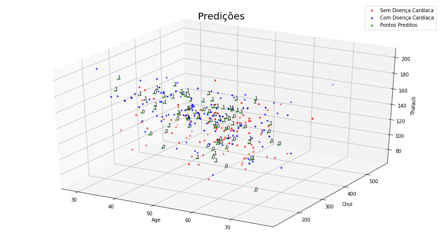

# Tarefa 2: Aprendizado Supervisionado

**Autor**: Matheus Jericó Palhares <br>
**LinkedIn**: https://linkedin.com/in/matheusjerico <br>
**Github**: https://github.com/matheusjerico

## 1) Tarefa 1: implementar a função “predict_KNN(pontos, ponto)”, que recebe o conjunto de treinamento e o ponto cuja classe será predita e retornada

- Para a tarefa 1: um scatter plot 3D mostrando os pontos de treinamento, os pontos que estão sendo preditos (acima deles, deve haver uma annotation com a classe em que foram classificados) e um código de cores intuitivo.
- Compare os seus resultados com os obtidos através do sklearn.neighbors.KNeighborsClassifier e do sklearn.neighbors.KNeighborsRegressor. Os seus resultados e os resultados do sklearn deveriam ser iguais.


### 1. Visualizando Graficamente (3D)

#### 1.1. Dados originais


### 1.2. Scatter plot 3D mostrando os pontos de treinamento, os pontos que estão sendo preditos (acima deles, deve haver uma annotation com a classe em que foram classificados) e um código de cores intuitivo




### 2. Comparando resultados entre modelos
#### 2.1. Modelo KNN Scratch

```python
clf = KNN(features=X_train, labels=y_train, k=3)
preds = clf.predict(test_set=X_test)
print('Acurácia KNN scratch: {}'.format(accuracy_score(y_test, preds)))
```

    Acurácia KNN scratch: 0.6222222222222222

#### Modelo KNN Scikit-Learn
```python
knn_sklearn = KNeighborsClassifier(n_neighbors=3)
knn_sklearn.fit(X_train, y_train)
preds = knn_sklearn.predict(X_test)
print('Acurácia KNN scikit-learn: {}'.format(accuracy_score(y_test, preds)))
```

    Acurácia KNN scikit-learn: 0.6222222222222222


## 2) Tarefa 2: implementar a função “predict_KNN(pontos, ponto)”, que recebe o conjunto de treinamento e o ponto cuja classe será predita, porém, aqui, você realizará uma regressão. Considere as features como sendo apenas age e chol, tendo thalach como o alvo da regressão. Esta tarefa deve ser realizada nos dois datasets fornecidos.

- Para a tarefa 2: um scatter plot mostrando os pontos de treinamento, os pontos que estão sendo preditos, um código de cores intuitivo que diferencie os pontos preditos dos pontos de treinamento e o erro total médio.
- Compare os seus resultados com os obtidos através do sklearn.neighbors.KNeighborsClassifier e do sklearn.neighbors.KNeighborsRegressor. Os seus resultados e os resultados do sklearn deveriam ser iguais.

## Dataset Heart

### 1. Visualizando Graficamente


### 2. Comparando modelos 
#### 2.1. Modelo KNN Regressor Scratch
    MSE: 491.35986394557824
    RMSE: 22.166638535095444

#### 2.2. Modelo KNN Regressor Scikit-Learn
    MSE: 492.9746031746032
    RMSE: 22.203031396063988


## Dataset COVID-19

### 1. Visualizando Graficamente


### 2. Comparando modelos 
#### 2.1. Modelo KNN Regressor Scratch

    MSE: 1868077.823389228
    RMSE: 1366.7764350431376

#### 2.2. Modelo KNN Regressor Scikit-Learn
    MSE: 1868079.366263703
    RMSE: 1366.776999463959
